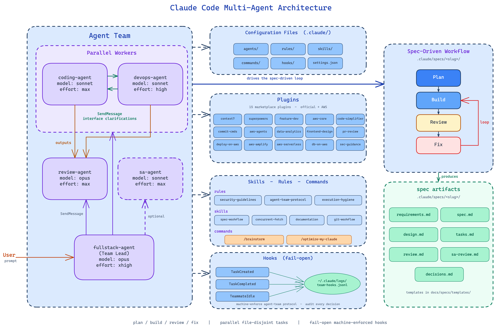

# Claude Code Multi-Agent Development Sample

A sample configuration for multi-agent development workflows using [Claude Code](https://docs.anthropic.com/en/docs/agents-and-tools/claude-code/overview). Demonstrates how to set up a team of specialized AI agents that collaborate through a spec-driven development process.

> **Disclaimer**: This repository is provided as an example only and is **NOT approved for production use**. The agent configurations, rules, and workflows are starting points — not production-ready defaults. You should review, adjust, and tailor them to fit your own project requirements, team conventions, and security posture. Adoption of this sample requires organizational legal review — you must complete the [LLM Legal Approval](#llm-legal-approval) and [MCP Server Legal Approval](#mcp-server-legal-approval) tables before use.

## Overview



This repo provides a sample `.claude` configuration with four core agents that work together:

| Agent | Role | Model |
|-------|------|-------|
| **fullstack-agent** | Team lead — researches, designs specs, creates plans, delegates work | opus |
| **coding-agent** | Implements features and writes tests from specs | opus |
| **devops-agent** | Infrastructure, CI/CD, containers, and documentation | sonnet |
| **review-agent** | Reviews implementations for correctness, security, and quality | opus |

Additional on-demand agents:

| Agent | Role | Model |
|-------|------|-------|
| **sa-agent** | AWS Solutions Architect — Well-Architected reviews, cost/security | sonnet |

The `fullstack-agent` orchestrates the workflow: it writes specs, breaks work into parallelized task groups, delegates to `coding-agent` and `devops-agent` for implementation, then sends the results to `review-agent` for feedback. This loop continues until the reviewer passes the work.

## How It Works

```
fullstack-agent (plan + research) → coding-agent + devops-agent (build in parallel) → review-agent (verify) → fullstack-agent (next group or fix)
```

1. **Plan** — `fullstack-agent` researches the problem, writes a spec (`spec.md`, `design.md`), and creates a parallelized task plan (`tasks.md`)
2. **Build** — `fullstack-agent` delegates task groups to `coding-agent` and/or `devops-agent` in parallel via `TeamCreate` and `SendMessage`
3. **Review** — `review-agent` analyzes the implementation and writes findings to `review.md`
4. **Fix** — if the review fails, `fullstack-agent` creates fix tasks and loops back to build

Agents coordinate through shared tasks (`TaskCreate`/`TaskUpdate`/`TaskList`) and direct messaging (`SendMessage`). The team lead uses `TeamCreate` to spawn teammates and `TeamDelete` to clean up after work is complete.

## Prerequisites

- [Claude Code](https://docs.anthropic.com/en/docs/agents-and-tools/claude-code/overview) installed
- [Node.js](https://nodejs.org/) (for `npx`-based MCP servers)
- [uv](https://docs.astral.sh/uv/) (for `uvx`-based MCP servers)
- AWS credentials configured (for AWS MCP servers that need API access)
- *(Optional)* [tmux](https://github.com/tmux/tmux) or [iTerm2](https://iterm2.com/) with Python API enabled — for split-pane display mode where each agent gets its own visible terminal pane. Without these, agent teams run in in-process mode (default), which works in any terminal.

## Quick Start

1. Install [Claude Code](https://docs.anthropic.com/en/docs/agents-and-tools/claude-code/overview)

2. Add the configuration files to your Claude Code config directory:

> **Warning**: If you already have a `~/.claude/` directory with your own configuration, the commands below will overwrite files with matching names. Back up first and consider merging manually (Option B).

**Option A — Fresh install** (no existing `~/.claude` config):

```bash
mkdir -p ~/.claude
cp -r agents/ ~/.claude/agents/
cp -r rules/ ~/.claude/rules/
cp -r skills/ ~/.claude/skills/
cp settings.json ~/.claude/settings.json
cp .mcp.json ~/.claude/.mcp.json
```

**Option B — Merge into existing config**:

```bash
# Back up your current config
cp -r ~/.claude ~/.claude.bak

# Copy agents, rules, and skills (won't overwrite existing files)
cp -rn agents/ ~/.claude/agents/
cp -rn rules/ ~/.claude/rules/
cp -rn skills/ ~/.claude/skills/

# Manually merge settings.json and .mcp.json into your existing files:
# - settings.json: merge the "env" and "enabledPlugins" keys
# - .mcp.json: merge the "mcpServers" entries
```

3. Enable the agent teams experimental feature in your `settings.json`:

```json
{
  "env": {
    "CLAUDE_CODE_EXPERIMENTAL_AGENT_TEAMS": "1"
  }
}
```

4. Install required plugins:

```bash
# Plugins are installed from the Claude Code marketplace.
# Enable them via settings.json (already configured) or interactively:
claude /plugins
```

5. Verify MCP servers are working:

```bash
# MCP servers in .mcp.json are auto-installed on first use via npx/uvx.
# To check their status:
claude /mcp
```

6. Start Claude Code:

```bash
claude
```

## Repository Structure

```
├── agents/                     # Agent definitions (markdown prompts with frontmatter)
│   ├── fullstack-agent.md      # Team lead — architecture, planning, coordination
│   ├── coding-agent.md         # Implements features and tests
│   ├── devops-agent.md         # Infrastructure, CI/CD, containers, docs
│   └── review-agent.md         # Code review and quality verification
├── .mcp.json                   # MCP server configurations used by agents and skills
├── rules/                      # Global behavioral rules for all agents
│   ├── spec-workflow.md        # Spec-driven development loop with parallel task groups
│   ├── agent-team-protocol.md  # Shared teammate lifecycle and communication protocol
│   ├── non-interactive.md      # All commands must run non-interactively
│   └── virtual-environments.md # Dependency isolation requirements
├── skills/                     # Domain-specific knowledge files
│   ├── documentation/          # Technical writing patterns
│   ├── git-workflow/           # Git operations and conventions
│   └── pr-review/              # Pull request review patterns
└── settings.json               # Claude Code settings (env vars, enabled plugins)
```

## Key Concepts

**Agents** define who does what. Each agent has a markdown file with YAML frontmatter (name, description, model) and a detailed system prompt (role, constraints, workflow). The team lead (`fullstack-agent`) spawns and coordinates teammates.

**Rules** are global behavioral constraints that apply to all agents. They enforce consistency — like requiring non-interactive execution, dependency isolation, or following the spec-driven workflow.

**Skills** are domain-specific knowledge that agents can reference. They provide patterns and best practices for specific tools and technologies (e.g., AWS CLI, Docker, CDK).

**Specs** are created at runtime in `.claude/specs/<slug>/` and contain the design decisions, task plans, review findings, and decision logs for each piece of work.

## Rules

| Rule | Purpose |
|------|---------|
| `spec-workflow.md` | Defines the full plan → build → review loop with parallel task groups and spec directory structure |
| `agent-team-protocol.md` | Shared teammate lifecycle — claiming tasks, communication patterns, verification gates, blocker reporting |
| `non-interactive.md` | All commands must run without user prompts — pass `-y`, `--yes`, `--no-input` flags |
| `virtual-environments.md` | Project dependency isolation per language (venv, node\_modules, cargo, go mod) |
| `AWS-security-guidelines.md` | Enforces AWS security best practices including least-privilege access, production safeguards, and credential handling |

## Plugins

This configuration enables the following Claude Code plugins via `settings.json`:

| Plugin | Purpose |
|--------|---------|
| context7 | Live documentation lookup for libraries and frameworks |
| superpowers | Enhanced development workflows (TDD, debugging, planning) |
| feature-dev | Guided feature development with architecture focus |
| code-review | Code review workflows |
| pr-review-toolkit | Comprehensive PR review with specialized agents |
| commit-commands | Git commit, push, and PR creation |
| github | GitHub issue/PR management |
| gitlab | GitLab issue/PR management |
| code-simplifier | Code clarity and maintainability refinement |
| security-guidance | Security best practices review |
| frontend-design | Production-grade frontend interface design |

## MCP Servers

MCP servers are configured in [`.mcp.json`](.mcp.json) and auto-installed on first use via `npx` or `uvx`. No manual installation is required.

| Server | Source | Purpose |
|--------|--------|---------|
| [aws-knowledge-mcp-server](https://knowledge-mcp.global.api.aws) | AWS (official) | AWS best practices and patterns |
| [awslabs.aws-documentation-mcp-server](https://github.com/awslabs/mcp) | AWS Labs | AWS service documentation lookup |
| [awslabs.aws-pricing-mcp-server](https://github.com/awslabs/mcp) | AWS Labs | AWS pricing data and cost analysis |
| [awslabs.aws-diagram-mcp-server](https://github.com/awslabs/mcp) | AWS Labs | Architecture diagram generation |
| [awslabs.aws-iac-mcp-server](https://github.com/awslabs/mcp) | AWS Labs | IaC patterns, CDK constructs, and CloudFormation validation |
| [awslabs.terraform-mcp-server](https://github.com/awslabs/mcp) | AWS Labs | Terraform provider documentation |
| [awslabs.document-loader-mcp-server](https://github.com/awslabs/mcp) | AWS Labs | Load external documents (PDFs, web pages) |
## Customization

- **Add agents**: Create a new `<name>.md` in `agents/` with frontmatter (`name`, `description`, `model`), then reference it in the fullstack-agent's team composition
- **Add rules**: Drop a markdown file in `rules/` — all agents will follow it
- **Add skills**: Create a `<name>/SKILL.md` in `skills/` — agents reference these for domain knowledge
- **Change models**: Edit the `model` field in each agent's YAML frontmatter. Available models: `opus`, `sonnet`, `haiku`
- **Add MCP servers**: Add entries to `.mcp.json` — servers are auto-installed via `npx`/`uvx` on first use

## LLM Legal Approval

| Field | Value |
|-------|-------|
| Service | Claude (Anthropic) |
| Approval Status | [To be completed by adopter] |
| Approval Date | [Date] |
| Approval Authority | [Legal/Procurement team] |
| License Terms | [Link to agreement] |
| Usage Restrictions | [Any limitations] |

> **Note**: Adopters must complete this section with their organization's legal approval status before using Claude Code in any project. Consult your legal and procurement teams for guidance on AI/LLM usage policies.

## MCP Server Legal Approval

Adopters must complete this table before using the MCP servers configured in [`.mcp.json`](.mcp.json).

| Server | Provider | Approval Status | Right to Use | Distribution Rights | Security Review |
|--------|----------|-----------------|--------------|---------------------|-----------------|
| aws-knowledge-mcp-server | AWS (official) | Approved (AWS ToS) | Yes | Yes | AWS-managed |
| awslabs.aws-documentation-mcp-server | AWS Labs | Approved (AWS ToS) | Yes | Yes | AWS-managed |
| awslabs.aws-pricing-mcp-server | AWS Labs | Approved (AWS ToS) | Yes | Yes | AWS-managed |
| awslabs.aws-diagram-mcp-server | AWS Labs | Approved (AWS ToS) | Yes | Yes | AWS-managed |
| awslabs.aws-iac-mcp-server | AWS Labs | Approved (AWS ToS) | Yes | Yes | AWS-managed |
| awslabs.terraform-mcp-server | AWS Labs | Approved (AWS ToS) | Yes | Yes | AWS-managed |
| awslabs.document-loader-mcp-server | AWS Labs | Approved (AWS ToS) | Yes | Yes | AWS-managed |
| awslabs.cdk-mcp-server | AWS Labs | Approved (AWS ToS) | Yes | Yes | AWS-managed |
> **Note**: Third-party MCP servers require independent legal and security review by your organization before use. AWS-provided servers fall under AWS Terms of Service.

## Dataset Compliance

No dataset is provided as part of this project. This repository contains only configuration files (agent definitions, rules, skills, and MCP server configurations) for setting up multi-agent development workflows. No training data, evaluation data, or other datasets are included or required.

## Security

See [SECURITY.md](SECURITY.md) for the full security overview including threat model, AI security controls, and risk assessment.

For security issue notifications, see [CONTRIBUTING](CONTRIBUTING.md#security-issue-notifications).

## License

This library is licensed under the MIT-0 License. See the [LICENSE](LICENSE) file.
